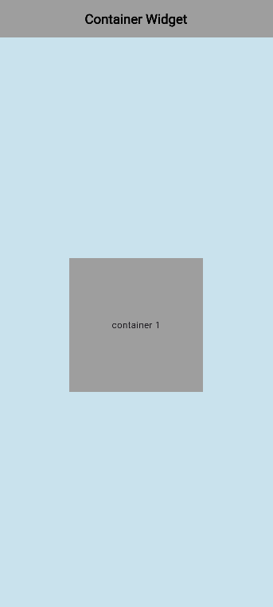

# Flutter Container Widget Demo

## Description

This is a simple Flutter app that shows how to use the **Container** widget. It demonstrates how to add background colors to the body and containers, as well as center widgets on the screen.

## Features

- **Container Widget**: Used to style and layout elements.
- **AppBar**: Customizes the top bar with text and color.
- **Background Color**: Shows how to add a background color to the body.
- **Centering Widgets**: Centers widgets on the screen.
  
*This is a screenshot of the app demonstrating the usage of the Container widget, custom AppBar, and centered elements.*
## What I Learned

1. **MaterialApp**: I learned how to use the `MaterialApp` widget to set up the app with a title, theme, and homepage.
   
2. **AppBar**: I learned how to add a custom AppBar and change its title and text style.

3. **Container Widget**: The `Container` widget allows me to set a size, color, and position of elements. I used two containers in this app.

4. **Adding Background Color**: I learned how to add a background color to the entire screen by using a **Container** widget around the body of the app.

5. **Center Widget**: I used the `Center` widget to center the inner container in the middle of the screen.

6. **Stateful Widgets**: I learned how to use a `StatefulWidget`, which allows the app to dynamically update its UI.


## How to Run

1. Make sure you have Flutter installed. If not, follow the [Flutter installation guide](https://flutter.dev/docs/get-started/install).
   
2. Clone or download this project to your computer.
    ```bash
   git clone https://github.com/username/repository-name.git


4. Open the project in your code editor (e.g., **Visual Studio Code**).

5. Run the following command in the terminal:
   ```bash
   flutter run
